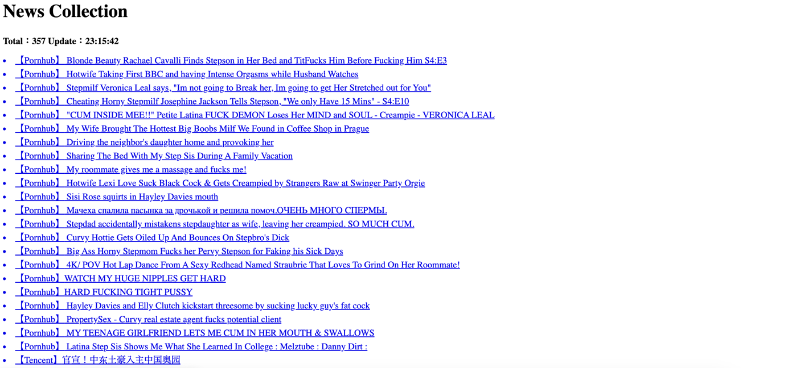

# Nodejs Crawling News Collection
Welcome to the Nodejs Crawling News Collection repository! This project is dedicated to developers and data enthusiasts who are interested in automating news collection. Using Node.js, this repository provides tools and scripts for efficiently crawling and collecting news data from various online sources.

### Screenshots


### Features
- **Crawling**: Automated crawling of news articles from multiple websites.
- **Data Extraction**: Extraction of relevant information such as titles and URLs.
- **Data Storage**: Storage of collected data in a structured format, such as HTML.
- **Customization**: Ability to customize the crawling process and data extraction logic.

### Getting Started
To get started with the Nodejs Crawling News Collection project, follow these steps:

1. **Clone the Repository**:
   ```bash
   git clone https://github.com/zhangboheng/nodejs-crawling-news-collection.git
   ```

2. **Install Dependencies**:
   Navigate to the project directory and install the required dependencies:
   ```bash
   cd nodejs-crawling-news-collection
   npm install
   ```

3. **Run the Scripts**:
   Execute the provided scripts to start the crawling process:
   ```bash
   node nodejs_crawling_news_collection.js
   ```

4. **Open the link**:
   ```bash
   http://localhost:43219
   ```

### Customization
You can customize the crawling process and data extraction logic by modifying the `nodejs_crawling_news_collection.js` file. This file contains the main logic for crawling and extracting news data.

First, you need to define the crawling options for different websites. The `options` object in the file contains the necessary configurations for each website, including the URI and headers.

```javascript
// Crawling options for different websites
const options = {
    cnn: {
        uri: 'https://lite.cnn.com/en',
        headers: {
            'User-Agent': 'Mozilla/5.0 (Windows NT 10.0; Win64; x64) AppleWebKit/537.36 (KHTML, like Gecko) Chrome/93.0.4577.82 Safari/537.36'
        }
    },
    pornhub: {
        uri: 'https://www.pornhub.com/',
        headers: {
            'User-Agent': 'Mozilla/5.0 (Windows NT 10.0; Win64; x64) AppleWebKit/537.36 (KHTML, like Gecko) Chrome/93.0.4577.82 Safari/537.36'
        }
    },
    sohu: {
        uri: 'https://business.sohu.com/',
        headers: {
            'User-Agent': 'Mozilla/5.0 (Windows NT 10.0; Win64; x64) AppleWebKit/537.36 (KHTML, like Gecko) Chrome/93.0.4577.82 Safari/537.36'
        }
    }
    ...
};
```

Next, you can customize the data extraction logic by modifying the `extractData` function. This function takes the HTML content of a webpage and extracts the desired information, such as titles and URLs.

```javascript
async function scrapeData() {
    const cnnData = await fetchData(options.cnn.uri, options.cnn.headers);
    if (cnnData) {
        const $ = cheerio.load(cnnData);
        $('.tabcontent ul li a').each(function() {
            selectArr.add(`<a href="${$(this).attr('href')}"><li><span>【CNN】</span>${$(this).text()}</li></a>`);
        });
    }

    const pornhubData = await fetchData(options.pornhub.uri, options.pornhub.headers);
    if (pornhubData) {
        const $ = cheerio.load(pornhubData);
        $('.title a').each(function() {
            selectArr.add(`<a href="${$(this).attr('href')}"><li><span>【Pornhub】</span>${$(this).text()}</li></a>`);
        });
    }

    const sohuData = await fetchData(options.sohu.uri, options.sohu.headers);
    if (sohuData) {
        const $ = cheerio.load(sohuData);
        $('#block4 a').each(function() {
            selectArr.add(`<a href="${$(this).attr('href')}"><li><span>【Sohu】</span>${$(this).text()}</li></a>`);
        });
    }
    ...
}
```

By modifying the `options` object and the `scrapeData` function, you can customize the crawling process and data extraction logic to suit your specific needs.

### Conclusion
The Nodejs Crawling News Collection project provides a convenient way to crawl and collect news data from various websites. By customizing the crawling options and data extraction logic, you can easily adapt the project to your requirements and extract the information you need.

### Tips
If you interest in the crawling news, you can refer to the following project links, which are similar to the project you are interested in:
- [LuckyNews-Box](https://github.com/zhangboheng/LuckyNews-Box): LuckyNews Box is a browser extension helps you get news quickly, supports API, DOM and RSS, all configured by yourself.
- [Invest-Smart-System](https://github.com/zhangboheng/Invest-Smart-System): This platform is designed to enhance your investment journey by providing a comprehensive suite of tools and resources.
- [Python-Crawling-Techniques](https://github.com/zhangboheng/Python-Crawling-Techniques): Explore advanced web crawling techniques showcased in this repo, featuring Python with Scrapy and Selenium for dynamic content and JavaScript-heavy sites. Dive in and enhance your scraping skills!
